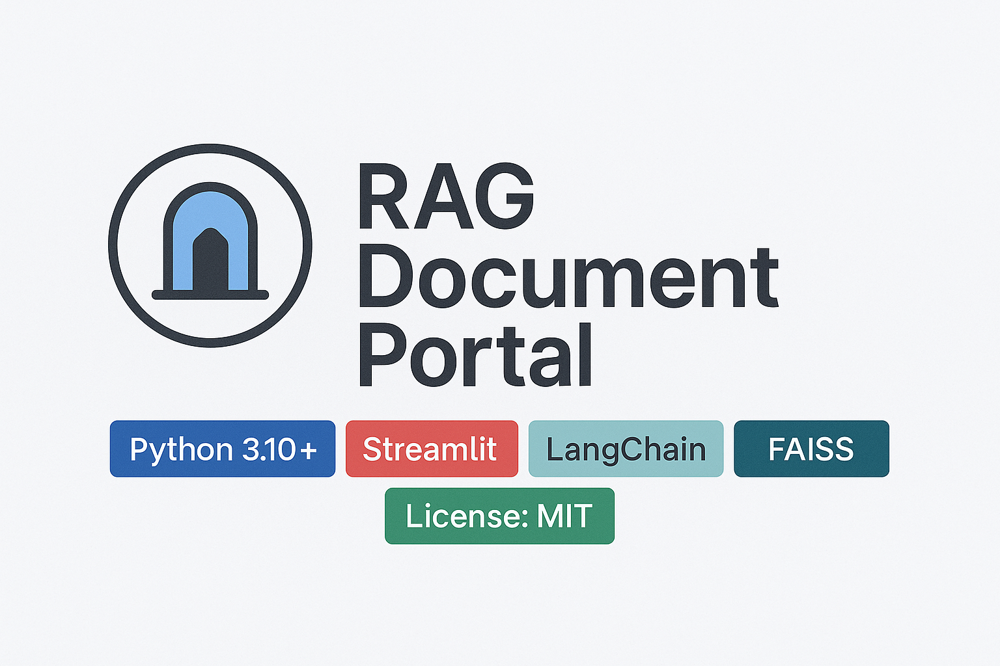

# RAG Document Portal  

<br><br>

[](LICENSE)  
[]()  
[]()  
[](https://github.com/emsikes/rag_document_portal)

---

## 🚀 Overview  
RAG Document Portal is a web‑based application that enables you to:  
- Upload documents (PDFs, text files, etc)  
- Perform summary analysis on individual documents  
- Compare two documents side‑by‑side for differences or similarities  
- Chat interactively with a **single** document or with **multiple** documents  

This tool is designed for AI/data engineers, knowledge‑workers, and teams who want to ingest, interact with and derive insights from document collections using retrieval‑augmented generation (RAG) workflows.

---

## ✨ Features

- 📂 **Document Uploads** – Add and manage documents directly from the portal.  
- 🔍 **Semantic Search** – Ask natural language questions across single or multiple documents.  
- 📝 **Summarization** – Generate concise summaries of uploaded content.  
- ⚖️ **Document Comparison** – Place two documents side by side for quick comparison.  
- 💬 **Conversational Interface** – Chat with your documents to uncover insights.  

---

## 🛠 Tech Stack  

### **Backend & APIs**  
- Python 3.9+  
- FastAPI (`api/main.py`)  
- Vector store (FAISS, Pinecone, etc.)  
- LLM API provider (OpenAI, Anthropic, etc.)

### **Frontend / UI**  
- Streamlit (`streamlit_ui.py`)  
- HTML/CSS templates (`templates/`)  
- Static assets (`static/`)

### **Application Logic & RAG Pipeline**  
- **src/** — Core RAG logic, document processing, embeddings, and pipeline orchestration  
- **exception/** — Custom exception configuration and handlers  

### **Other Components**  
- Logging utilities (`logger/`)  
- Data models (`models/`)  
- Notebooks (`notebooks/`)  
- Prompt templates (`prompts/`)  
- Utility helpers (`utils/`)  
- Automated tests (`tests/`) 

---

## ✅ Prerequisites  
- Python 3.9 or higher  
- `pip` or `poetry`  
- LLM API key (OpenAI, etc.)  
- Optional: vector store endpoint configuration  

---

## 🏁 Getting Started

### 1. Clone the repository  
```bash
git clone https://github.com/emsikes/rag_document_portal.git
cd rag_document_portal
```

### 2. Install dependencies  
```bash
pip install -r requirements.txt
```

Or using Poetry:

```bash
poetry install
```

### 3. Configure environment variables  
Create a `.env` file or update config settings:

```
OPENAI_API_KEY=your_key
VECTOR_STORE_ENDPOINT=your_value
```

### 4. Run the backend API  
```bash
uvicorn app:app --reload
```

### 5. Run the Streamlit UI  
```bash
streamlit run streamlit_ui.py
```

### 6. Access the application  
- API docs: http://127.0.0.1:8000/docs  
- UI: http://localhost:8501  

---

## 🧪 Running Tests  
```bash
pytest
```

---

## 🧩 Project Structure  
```
├── README.md
├── requirements.txt
├── streamlit_ui.py
├── setup.py
│
├── api/
│   └── main.py           ← FastAPI backend entrypoint
│
├── src/                 ← Main RAG application logic
│
├── exception/           ← Custom exception configuration
│
├── config/
├── logger/
├── models/
├── notebooks/
├── prompts/
├── static/
├── templates/
├── tests/
└── utils/
```
---

## 🤝 Contributing  
1. Fork the repo  
2. Create a feature branch  
3. Commit changes  
4. Push  
5. Open PR  

---

## 📄 License  
MIT License — see LICENSE file.

---

## 🎯 Contact  
Created by **Matt Sikes**  
GitHub: https://github.com/emsikes  

